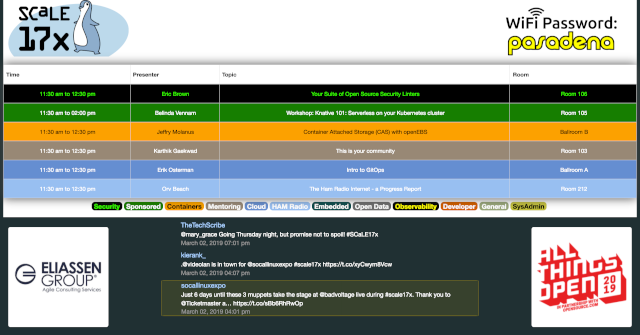
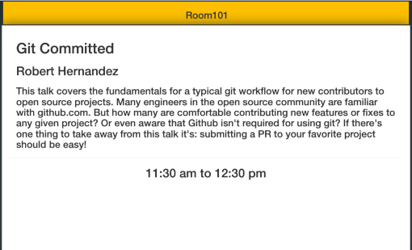
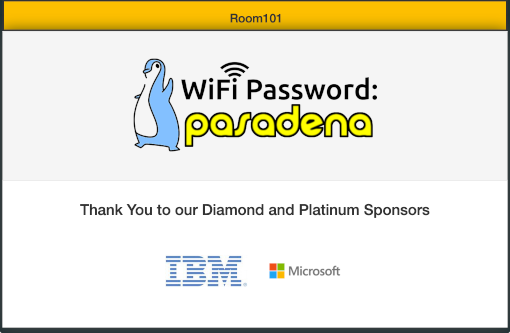

# scale-signs

digital signs for the Southern California Linux Expo

### Server

* php5.4 with Apache httpd
* pulls an XML version of the conference speaking schedule down for the public socallinuxexpo.org web server
* pulls a twitter feed of SCaLE related hashtags
* sends formatted HTML to clients with the scale logo, wifi password, a scrolling schedule, sponsor logos, and relevant tweets

### Client

* python script using the GTK library to simulate a full screen web browser which typically runs on raspberry pis

### Views

#### Schedule

The main index page will display a carousel with a grid view of all currently running and upcoming sessions. The PI displays in the hallways typically display this view.

example: `http://signs.scale.lan/`

#### Room

The index page call be called with a room argument to display a room specific view that will display information relevant to that room.

Optimized for viewing at `1024x768` using one of the following room values:

* ballroom-a
* ballroom-b
* ballroom-c
* ballroom-de
* ballroom-f
* ballroom-g
* ballroom-h
* room-101
* room-103
* room-104
* room-105
* room-106
* room-107
* room-209
* room-211
* room-212

examples:
* `http://signs.scale.lan/?room=ballroom-de`
* `http://signs.scale.lan/?room=room-101`

#### Development

It is sometimes necessary to test what the displays will look like at times other than the current. In order to do this the following variables must be modified in the uri:

* year
* month
* day
* hour
* minute 

This is available in both Schedule and Room views

examples: 
* `http://signs.scale.lan/?year=2019&month=3&day=7&hour=9&minute=10`
* `http://signs.scale.lan/?room=ballroom-de&year=2019&month=3&day=8&hour=14&minute=33`

### Yearly Tasks

There is a bit of manual effort necessary from year to year. These tasks include, but might not be limitted to:
* ~~update the logo for the curent year at `/server/images/header.png`~~
* ~~Do a search and replace for the previous scale version (example: replace all occurances of 16x with 17x)~~
* ~~verify proper XML is being supplied by drupal from the url reflected in the `$url` variable in `room.php` and `scroll.php`~~
* set `$starttime` in `scroll.php` which should reflect midnight of the first night of current year show
* set `$starttime` in `room.php` to match scroll.php
* set `$room_lookup_table` in `room.php` to match all rooms being used for the current year
* set `$room_lookup_table` in `index.php` to match the one in `room.php`
* update `$shorten_topics` in `scroll.php` to reflect the updated track list, matching exactly the keys to what is being supplied by the xml from drupal minus spaces
* update `$shorten_topics` in `room.php` to match `scroll.php`
* create a style for each of the keys in `$shorten_topics` in `style.css` matching it to the public site
* ~~update the sponsor images in `/server/images/sponsors/` to reflect the current year's sponsors, making them 220x220~~
* ~~update `$sponsors` in `room.php` matching the value to each sponsor image file name~~
* update `$sponsors_to_rooms` in `room.php` matching proper sponsor(s) to room and day by key from `$sponsors`
* ~~update the `$sponsors` arrays in `sponsors.php` attempting to distribute the list evenly across both case statements~~
* update the `$diamond_platinum_sponsors` array in `room.php` with the current year diamond and platinum sponsors
* update the `$gold_sponsors` array in `room.php` with the current year gold sponsors
* verify OAUTH keys and secrets being passed to `$settings` in `twitter.php` via `secrets.env` are functional

### Tips

Get rooms in use this year with:

`export THIS_SCALE=19x; curl http://www.socallinuxexpo.org/scale/${THIS_SCALE}/sign.xml | grep "<Room>" | cut -d ">" -f 2 | cut -d "<" -f 1 | sort | uniq`

Get shortened topic list this year with:

`export THIS_SCALE=19x; curl -q http://www.socallinuxexpo.org/scale/${THIS_SCALE}/sign.xml | grep "<Topic>" | cut -d ">" -f 2 | cut -d "<" -f 1 | sort | uniq | sed 's/ //g'`

### Conference Operations

* git
* docker
* docker-compose

#### DST Issues

If DST changes during SCaLE, the next morning `$starttime` in `scroll.php` and `room.php` will need to be adjusted by an hour otherwise the schedule will be off. This should be as simple as following the instructions in the comments at the top of each file.

#### Build and start Service

1. `git pull $this_repo`
2. copy `samples-secrets.env` to `secrets.env` and populate with correct values
3. `docker-compose up -d`

#### Update from repo

1. `git pull $this_repo`
2. `docker-compose build`
3. `docker-compose down`
4. `docker-compose up -d`
> You might need to force rebuilding without cache: `docker-compose build --no-cache`

#### Troubleshooting Basics

* `docker-compose ps`
* `docker-compose logs [-f]`
* `docker-compose top`

### Local Testing:

* docker
* docker-compose

1. `touch secrets.env` to omit secrets or copy `sample-secrets.env` to `secrets.env` and populate to test with them
2. `docker-compose build` (repeat this every time code is changed to view results)
3. `docker-compose up -d`
4. browse to `http://localhost`
